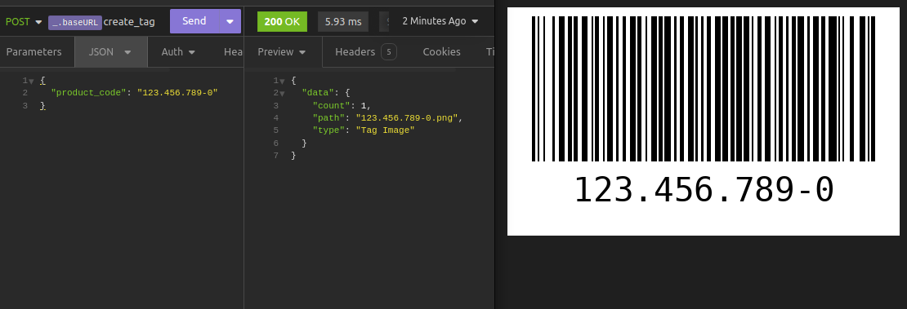

<h1 align="center">
  
</h1>

  <a href="#technologist-tecnologias">Tecnologias</a>&nbsp;&nbsp;&nbsp;|&nbsp;&nbsp;&nbsp;
  <a href="#-projeto">Projeto</a>&nbsp;&nbsp;&nbsp;|&nbsp;&nbsp;&nbsp;
  <a href="#-como-executar">Como executar</a>&nbsp;&nbsp;&nbsp;|&nbsp;&nbsp;&nbsp;
  <a href="#-licença">Licença</a>

  
  
  

  

## :technologist: Tecnologias

Este projeto faz uso das seguintes tecnologias:
- [Python](https://www.python.org/).
- [Flask](https://flask.palletsprojects.com/).
- [Pytest](https://docs.pytest.org/)
- [Cerberus](https://docs.python-cerberus.org/)
- [Python Barcode](https://python-barcode.readthedocs.io)

## 💻 Projeto

O Expert Codebars é uma aplicação que permite ao usuário criar código de barras para produtos, faz uso de diversas tecnologias que permitem o projeto ser escalável.

<b>Desenvolvido durante o Next Level Week Expert da Rocketseat.</b>

## 🚀 Como executar

Este projeto foi desenvolvido utilizando o Python 3.11.6 é sugerido a mesma versão ou maior.
As etapas estão sendo explicadas para executar o projeto em ambiente Linux.
Digite todos os comandos direto no terminal.

- Clone este repositório;
- Na raiz do projero crie um ambiente virtual `python -m venv venv`;
- Ative o ambiente virtual `source ./venv/bin/activate`;
- Certifique-se de estar com o ambiente virtual ativo e estar na raiz do projeto, então digite `pip install -r ./requirements.txt`;
- Para iniciar o servidor digite `python run.py` ele deverá executar em localhost:3000;
- Utilizando Postman, Insomnia ou uma ferramenta de sua preferencia realize:
  - POST em localhost:3000/create_tag com o seguinte body/json:
  - `{ "product_code": "123.456.789-0" }`

Se tudo ocorreu corretamente a etiqueta gerada deverá estar na raiz do projeto.

## 📄 Licença

Acesse [LICENSE](LICENSE.md) para mais informações sobre a licença.

## ♥ Agradecimento

A toda a equipe da Rocketseat por mostrar os caminhos para o próximo nível!
